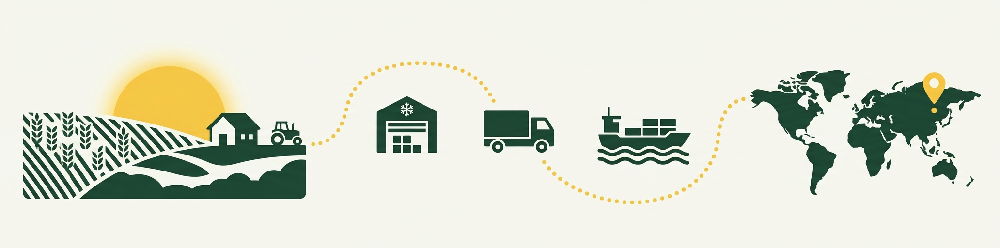
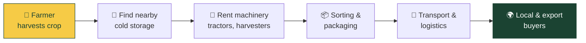
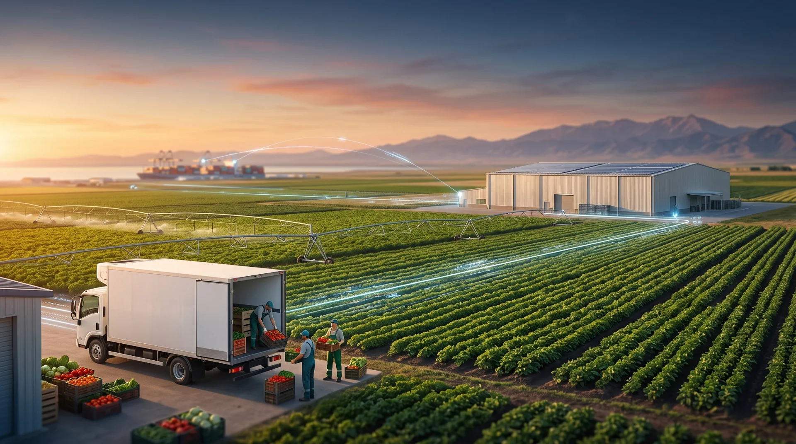
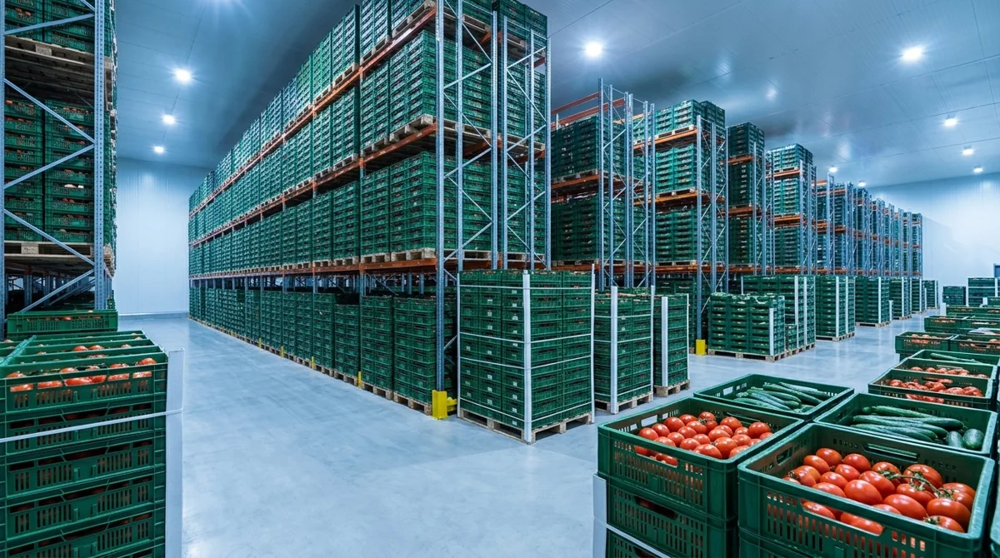
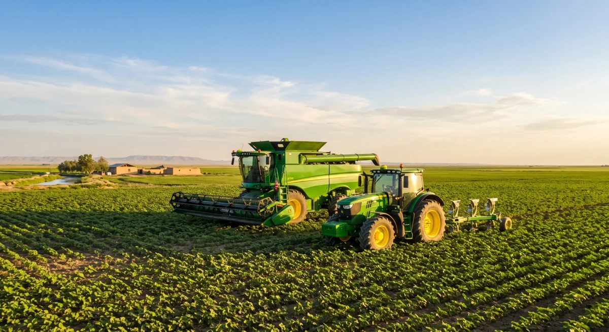
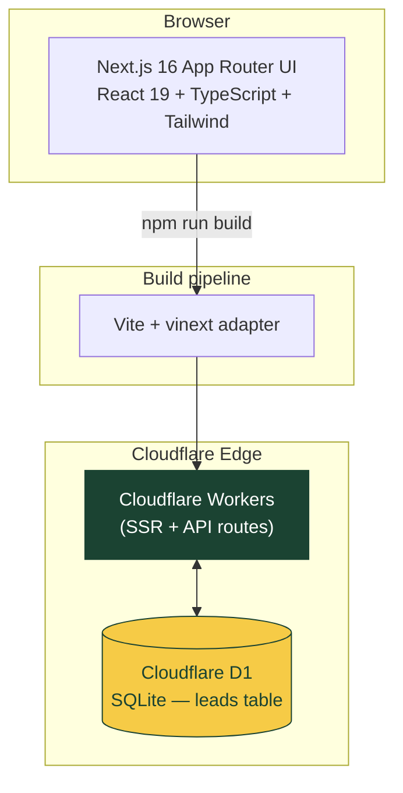

<p align="center">
  
</p>

<h1 align="center">AGROGO</h1>
<p align="center"><b>From farm to export — one platform.</b></p>

<p align="center">
  
  
  
  
  
  
  
</p>

<p align="center">
  <a href="#getting-started"></a>
  <a href="#"></a>
  <a href="#project-structure"></a>
  <a href="mailto:hello@agrogo.example"></a>
</p>

<!--
  Replace the Live Demo / Contact links above with your real deployment URL
  and email once available. See docs/IMAGE_PROMPTS.md for how docs/banner.png
  was generated.
-->

---

AGROGO is an agro-logistics marketplace that connects farmers with cold-storage warehouses, agricultural machinery owners, packaging services, transport companies, and buyers — all in one place.

After harvest, a farmer has to figure out where to store the crop, how to package it, who can transport it, and who will buy it. At the same time, other regions may have empty warehouses and idle machinery sitting unused. AGROGO brings this supply and demand together on a single digital marketplace, reducing post-harvest loss and making it easier for farmers to reach the market.

## Table of Contents

- [How it works](#how-it-works)
- [Screenshots](#screenshots)
- [Target users & markets](#target-users--markets)
- [Revenue model](#revenue-model)
- [Tech stack](#tech-stack)
- [Architecture](#architecture)
- [Project structure](#project-structure)
- [Getting started](#getting-started)
- [Deployment](#deployment)
- [Status & limitations](#status--limitations)
- [Resources](#resources)

## How it works



## Screenshots

<table>
  <tr>
    <td width="50%"><p align="center"><sub>Hero — farm &amp; logistics</sub></p></td>
    <td width="50%"><p align="center"><sub>Cold-storage warehouses</sub></p></td>
  </tr>
  <tr>
    <td width="50%"><p align="center"><sub>Agricultural machinery</sub></p></td>
    <td width="50%"><p align="center"><sub>Transport &amp; export</sub></p></td>
  </tr>
</table>

## Target users & markets

| | |
| --- | --- |
| 👨‍🌾 **Farmers** | Small & medium farms, large agro-clusters |
| 🏭 **Service providers** | Warehouses, machinery owners, packing, transport companies |
| 📦 **Exporters & buyers** | Local and foreign wholesale buyers |

**Initial export markets:** 🇰🇿 Kazakhstan · 🇷🇺 Russia · 🇰🇬 Kyrgyzstan · 🇦🇪 UAE

## Revenue model

AGROGO takes a **5–15% commission** on each completed transaction — storage, machinery rental, packaging, transport, or export sale — depending on the service type.

## Tech stack

| Layer | Technology |
| --- | --- |
| Frontend | Next.js 16 (App Router), React 19, TypeScript |
| Styling | Tailwind CSS 4, shadcn/ui, Radix UI |
| Animation / 3D | Framer Motion, GSAP (ScrollTrigger), Three.js + React Three Fiber |
| Internationalization | next-intl (`uz`, `ru`, `en`) |
| Database | Drizzle ORM + Cloudflare D1 (SQLite) |
| Validation | Zod, React Hook Form |
| Build / deploy | Vite + [vinext](https://www.npmjs.com/package/vinext) → Cloudflare Workers |

## Architecture



## Project structure

```
app/[locale]/            /uz, /ru, /en pages with locale-aware SEO
app/api/leads/            API route that accepts interest submissions
app/layout.tsx, globals.css  Shared layout, fonts, colors, dark mode
middleware.ts, i18n/       Locale detection: cookie → Accept-Language → uz fallback
messages/                 uz.json, ru.json, en.json — all UI copy
components/sections/       Landing page sections (hero, problem, journey,
                           services, example, geography, audience, impact, join)
components/three/          Lazy-loaded Three.js/R3F export globe
components/ui/             shadcn/ui-based reusable components
lib/lead-schema.ts         Zod schema for the interest form
db/schema.ts, drizzle/     D1 table definition and migrations
data/                      GeoJSON geometry used by the maps
scripts/                   Build & environment scripts for Cloudflare/vinext
public/images/              Optimized WebP images
```

## Getting started

**Requirements:** Node.js `>=22.13.0`

```bash
npm install           # install dependencies
npm run dev            # start local dev server
npx tsc --noEmit        # type-check
npm run lint            # run ESLint
npm run db:generate      # generate a new Drizzle migration after schema changes
npm run build            # build for Cloudflare Workers
```

`npm run start` runs the local Cloudflare Workers environment (`wrangler dev` + D1) against the built output, so run `npm run build` first.

If the site's domain changes, update it in `app/[locale]/page.tsx`, `app/robots.ts`, and `app/sitemap.ts`.

## Deployment

The app is built with Vite via the `vinext` adapter and deployed to **Cloudflare Workers**, with **Cloudflare D1** storing submitted leads. There is no separate backend service — SSR and the API route run together at the edge.

## Status & limitations

- The interest form validates name, international phone format, region, service type, and consent on the server; submissions are stored in a private D1 table with no public-facing endpoint.
- An idempotent lead ID prevents duplicate submissions on retry.
- Warehouse/machinery counts, the partner registry, and impact numbers shown on the site are currently **sample data** — no live partner network is connected yet.
- No phone number, email, or official social accounts are published on the site; the only contact path is the interest form.

## Resources

- Map data: [Natural Earth (public domain)](https://www.naturalearthdata.com/about/terms-of-use/)
- [next-intl configuration](https://next-intl.dev/docs/usage/configuration)
- [React Three Fiber performance scaling](https://r3f.docs.pmnd.rs/advanced/scaling-performance)
- [GSAP matchMedia & reduced motion](https://gsap.com/docs/v3/GSAP/gsap.matchMedia/)

---

<p align="center"><sub>Built for smallholder and mid-size farms exporting across Central Asia.</sub></p>